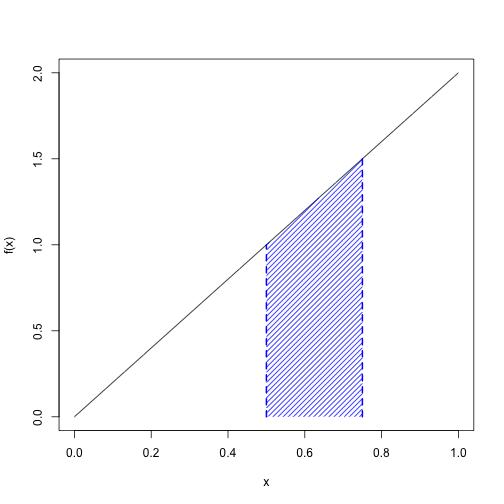
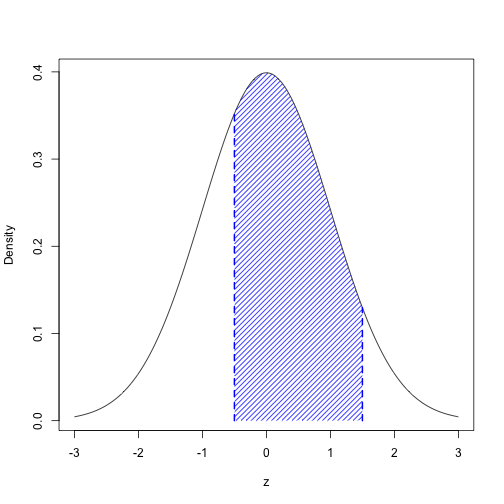
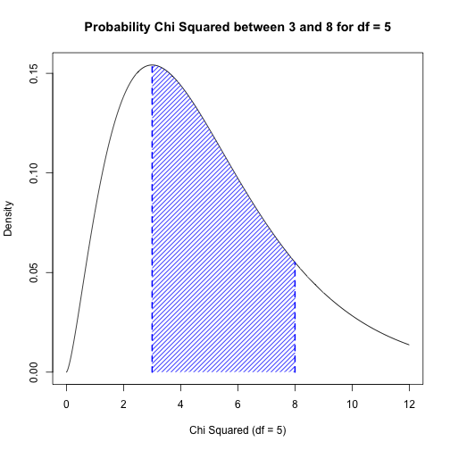

# README
## plot.and.return
This is a simple R function that calculates a definite integral over a continuous region of a function and plots the associated shaded region. It was originally written to help visual probability distributions associated with continuous random variables.

The function is designed to take in the following parameters:

* ```f```<br>An arbitrary function.
* ```min.x``` and ```max.x```<br>Defining the region of the domain over which we wish to see the plot.
* ```a``` and ```b```<br>The integral bounds.
* ```dx```<br>The optional step size.
* ```...```<br>Any additional parameters for ```plot```.

```plot.and.return``` is defined as follows:


```r
plot.and.return <- function(
  f,             # density function
  min.x,         # graph visible region
  max.x,  
  a, b,          # integral bounds
  dx = 0.01,     # optional step size
  ...            # additional plot parameters
) {
  x <- seq(min.x, max.x, by = dx)
  d <- seq(a, b, by = dx)
  plot(x, f(x), type = "l", ...)
  polygon(
    c(a, d, d[length(d)]), c(0, f(d), 0), 
    col = "blue",
    border = NA,
    lty = 1,
    angle = 45,
    density = 20
  )
  lines(c(a, a), c(0, f(a)), lwd = 2, lty = 2, col = "blue")
  lines(c(b, b), c(0, f(b)), lwd = 2, lty = 2, col = "blue")
  integrate(f, a, b, subdivisions = round((b - a) / dx))
}
```

## Examples


```r
# A user-defined, triangular probability density function
plot.and.return(
  function(x) 2 * x,   # pdf
  0, 1,                # Domain bounds
  0.5, 0.75            # Integral bounds
)
```

 

```
## 0.3125 with absolute error < 3.5e-15
```


```r
# Using a density function that already exists
plot.and.return(
  dnorm,            # The standard normal curve
  -3, 3,            # Three standard deviations about the mean visible
  -0.5, 1.5,        # Integral bounds
  xlab = "z",       # Parameters for plot
  ylab = "Density"
)
```

 

```
## 0.6247 with absolute error < 6.9e-15
```


```r
# Using a density function that already exists
# but with user defined parameters
plot.and.return(
  function(x) dchisq(x, df = 5), 
  0, 12, 
  3, 8, 
  xlab = "Chi Squared (df = 5)", 
  ylab = "Density",
  main = "Probability Chi Squared between 3 and 8 for df = 5"
)
```

 

```
## 0.5438 with absolute error < 6e-15
```
